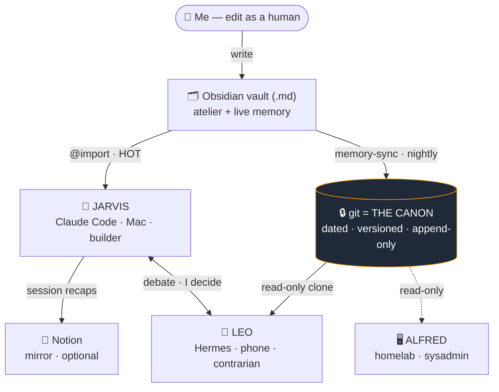
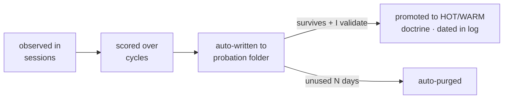

# 🤖 manin-control-room


> **One brain · many runtimes · zero hidden LLM calls.**
> A personal AI butler engine — the memory is a Markdown vault, the canon is git, the model runs only when I say so.

> 🧪 **Sanitized template** — the structure of an assistant I drive every day, personal content stripped and replaced by fill-in-the-blank files. Fork it, make it yours.

### ⚡ At a glance

- 🗂️ **Memory** = an Obsidian vault (`.md`), `@import`-ed straight into context — *edit the note, the assistant knows*
- 🔒 **Canon** = git, append-only. Vault / laptop / Notion disagree → **git wins**
- 👥 **Staff** = **Jarvis** (build · terminal) · **Leo** (challenge · phone) · **Alfred** (ops · homelab)
- 🧠 **Tiered memory** = HOT / WARM / COLD / path-scoped — only the relevant slice loads
- 🛡️ **Guardrails** = real incidents, dated — fork the rules, the *why* comes with them
- 🚫 **No background cron calls the model** — everything runs through a manual dispatcher

---

## 🧠 The idea — one brain, many runtimes

> The interesting part of "personal AI" isn't the prompt — it's **where the memory lives and who's allowed to touch it.**

| | |
|--|--|
| 🗂️ **Memory** | An Obsidian vault. The same files I read as a human *are* the assistant's memory. No export step, no drift. |
| 🔒 **Canon** | Mirrored nightly to git — the versioned record Leo reads and what survives a wiped machine. |
| 📓 **Notion** | A throwaway mirror I skim on mobile. Handy, never a source. |
| 🔁 **Runtimes** | The brain doesn't move; the runtimes are swappable. |



---

## 👥 The staff

> One shared doctrine, three deliberately different jobs **and models** — so they don't share blind spots. Jarvis and Leo debate; **I decide.**

| Agent | Where | Role | Runs on |
|-------|-------|------|---------|
| 🤖 **Jarvis** | terminal (macOS) | **Builder** — writes code, runs routines, edits the vault. Commits locally; never pushes/deploys without a yes. | Claude Code |
| 📱 **Leo** | phone (Telegram) | **Contrarian** — reads the canon read-only, answers with verdicts (*validated / with-reservations / not-validated*), not flattery. | self-hosted [Hermes](https://nousresearch.com) |
| 🖥️ **Alfred** | homelab (Proxmox) | **Sysadmin** — ops only, narrow blast radius. | scoped model |

🛳️ A separate cockpit — [`thousand-sunny`](https://github.com/ibhugeloo/thousand-sunny) — drives them in parallel, each in its own colored terminal session.

---

## 🧩 The memory model

| Tier | When loaded | What goes there |
|------|-------------|-----------------|
| 🔥 **HOT** | every session (`@import` in `CLAUDE.md`) | persona, profile, decisions, core workflows |
| 🌤️ **WARM** | on context match (cwd / keywords) | one file per project or domain |
| 🧊 **COLD** | only on explicit request | archives, history, raw logs |
| 📌 **path-scoped** | mechanically, when I open matching code | that project's client/infra rules |

> **Admission to HOT is strict** — only what's relevant in ≥ 50 % of sessions, or a high-blast-radius guardrail. *"The garage must not become the house."* Path-scoped rules exist because keyword-matching is fragile — I want a client's rules loaded *because I opened the client's code*, not because I said a magic word.

---

## ⚙️ How it works

| Phase | What happens |
|-------|--------------|
| 🌅 **Morning** | `jarvis jour` → one brief: calendar, important mail, repo git state, vault to-dos, client activity. Empty section → `RAS`, never filler. |
| 🔨 **Building** | 2–3 Claude Code sessions in parallel. A `SessionStart` hook shows which others are live → no clobbering another session's WIP. |
| 🚢 **Client work** | Gated pipeline `/jarvis-ship` (below). **Path-scoped rules** load *that project's* doctrine when I open its code — infra target, deploy gotchas, RGPD, "never DELETE in prod via API". |
| ✅ **"Ready"?** | Self-critique **first** — 🔴 critical / 🟡 watch / 🟢 minor. "Tests green ≠ prod-ready." Client code ships with **E2E** of the real flows. |
| 📱 **On the move** | Ask Leo from the phone — different model, read-only, there to poke holes, not to agree. |
| 🌙 **Night** | Self-eval samples sessions + lessons, proposes doctrine promotions. **Persona changes need my explicit yes** — silence is never consent. |

**Gated delivery** — confirm each phase, nothing ships or deploys without a yes:


<details><summary>🔁 <b>How a habit becomes doctrine</b> (the anti-rot loop)</summary>



Low-risk skills auto-write themselves into an audited probation folder. Anything that changes the **persona** or a **dated decision** requires explicit approval. The decision log is **append-only** — revising a choice means a new dated entry, never a rewrite, so the assistant can always detect when a new idea contradicts a past one and stop me.
</details>

---

## 🛡️ Guardrails, forged from incidents

> Every rule has a scar behind it. You can fork the rules — you can't fork the scar tissue, so the *why* sits next to each.

| | Rule | The incident behind it |
|--|------|------------------------|
| 🔴 | **Sequential state ops** | one mutating git/deploy at a time, verified — after a session hallucinated a merge on phantom SHAs. A `PreToolUse` hook now blocks batched mutating git/`gh`. |
| 🔴 | **Tests green ≠ prod-ready** | mandatory self-critique + real **E2E** on client code — after shipping a feature on unit tests alone. |
| 🔴 | **Pre-external-action gate** | re-read reference + decisions before any push/deploy/DNS — after phrasing an already-documented deploy as an open question. |
| 🟡 | **Memory-size cap** | a hard ceiling on always-loaded doctrine — after it bloated to "knows too much, arbitrates badly." |
| 🟡 | **Context-discipline watch** | a hook warns at session-size thresholds — risky prod work waits for a fresh context (no "dumb zone"). |

→ **Full operating doctrine:** [**BEST-PRACTICES.md**](./BEST-PRACTICES.md) — every rule, actionable, with its incident.

---

## 🧰 Tech stack

> Nothing exotic — the point is the *architecture*, not the dependencies.

| Layer | What it is |
|-------|-----------|
| 🧠 **Brain / memory** | An [Obsidian](https://obsidian.md) vault of Markdown, `@import`-ed into context — mirrored nightly to **git** (the canon) |
| 🤖 **Builder runtime** | [Claude Code](https://claude.com/claude-code) (Anthropic) on macOS — tiered memory per session |
| ⚙️ **Engine** | ~30 **zsh/bash** scripts (dispatcher, routines, hooks, guards, UI) + **Python 3** for the heavier bits |
| 🔎 **Semantic search** | `sqlite-vec` + `sentence-transformers` — local embeddings, fully offline |
| 🗃️ **Mission OS** | **FastAPI** + Pydantic + **SQLite** — bounded tasks with state |
| 🎛️ **Control surface** | Claude Code **hooks** + **slash commands** + **path-scoped rules**, wired by `bootstrap.sh` |
| ⏰ **Scheduling** | macOS **launchd** templates (opt-in — every model-calling cron is off by default) |
| 🛰️ **Other runtimes** | **Leo** = self-hosted [Hermes](https://nousresearch.com) over **Telegram** · **Alfred** = homelab sysadmin |

🍎 macOS-first by design (launchd, `~/.local/bin`, shell hooks). No build step, no framework lock-in.

---

## 📦 What's in the box

```
memory/        ← the doctrine (persona, profile, decisions, dreams, workflows) — HOT files
share/         ← prompts for each routine (brief, weekly, eval, watchtower, finance…) + missions
bin/           ← the engine: dispatcher, semantic vault search, routines, hooks, guards, UI server
claude-config/ ← Claude Code hooks + slash commands + path-scoped rules + the @import list
docs/          ← how each subsystem works (one doc per subsystem)
config/        ← per-project config (watchtower, finance…) — *.example.yaml here
LaunchAgents/  ← macOS launchd templates for the scheduled routines (opt-in)
mos/           ← Mission OS: bounded tasks with state (FastAPI + SQLite)
tests/         ← doctrine scenarios — the persona's rules are *tested*, not just written
```

---

## ⌨️ Command reference

> Everything the model does, it does because I typed one of these. **No hidden cron calls the LLM.**

**Dispatcher** — `jarvis <verb>`, strictly manual:

| Command | What it does |
|---------|-------------|
| `jarvis jour` | Morning brief — calendar, mail, repo git state, vault to-dos, client activity |
| `jarvis hebdo` · `mensuel` | Weekly review · monthly retrospective |
| `jarvis veille` | Daily watch pass |
| `jarvis evaluation` | Self-review — detect patterns, propose doctrine promotions |
| `jarvis watchtower` | Prod health of client projects (Sentry / Vercel / Supabase) |
| `jarvis finance` | Earnings analysis of the tracked portfolio |
| `jarvis tech-watch` | External agentic / Claude Code watch |
| `jarvis notion-sync` | Pull Notion → vault (≈ monthly) |
| `jarvis memory-sync` | Mirror the memory vault to private git |
| `jarvis sessions-purge` | Archive to Notion + purge session recaps > 90 days |

**Slash commands** — inside a Claude Code session:

| Command | What it does |
|---------|-------------|
| `/jarvis-ship` | Gated delivery pipeline — Research → Plan → Execute → Review → Ship |
| `/jarvis-jour` · `/jarvis-watchtower` · `/jarvis-finance` · `/jarvis-tech-watch` · `/jarvis-audit` | Run the matching routine in-session |
| `/observe` | Capture a user-model observation into the doctrine |
| `/save` | Snapshot the current session into the vault |

---

## 🚀 Getting started

Two paths — pick yours:

- 🐣 **Gentle path** — no coding, macOS, ~45 min (folded below). A working butler in your terminal that remembers you, *without* the phone/server parts.
- 👨‍💻 **Developer path** — clone, fill templates, `bootstrap.sh`.

```bash
# Developer path
git clone https://github.com/ibhugeloo/manin-control-room.git
cd manin-control-room
for f in memory/*.example.md;   do cp "$f" "${f%.example.md}.md"; done
for f in config/*.example.yaml; do cp "$f" "${f%.example.yaml}.yaml"; done
# Fill in memory/*.md + config/*.yaml, point @imports at your vault path:
./bootstrap.sh
```

`bootstrap.sh` symlinks `bin/` into `~/.local/bin`, wires the Claude Code hooks, and (optionally) installs the launchd routines. **Idempotent** — re-run to update.

> 🍎 **Not on a Mac?** The engine assumes macOS (launchd, `~/.local/bin`, shell hooks). Linux works with minor tweaks; Windows needs WSL — both advanced and undocumented for now.

<details><summary>🐣 <b>The gentle path</b> — no coding required, macOS, step by step</summary>

**What you'll have at the end:** you type `claude` in a folder, and your assistant already knows who you are, your tone rules, and remembers things between conversations.

> **Real talk first.** This runs on a **Mac**, needs a **paid Anthropic account** (Claude Code), and you'll **copy-paste a few Terminal commands**. Never opened Terminal? Fine — follow exactly, budget ~45 min. You do **not** need Leo, Alfred, a homelab, or any routine to start.

**1. Install the two apps**
- [Obsidian](https://obsidian.md) — a free note-taking app. Becomes your assistant's memory (and yours).
- [Claude Code](https://claude.com/claude-code) — Anthropic's terminal assistant. Follow their installer and sign in (the paid part).

**2. Download this template (no git needed)**
- Green **`Code`** button → **Download ZIP**. Unzip it, move it to **Documents**, rename to e.g. `my-jarvis`.

**3. Open Terminal in that folder**
- In Finder, right-click the folder → **Services** → **New Terminal at Folder**.

**4. Turn the blank templates into your files** — paste, Enter:
```bash
for f in memory/*.example.md;   do cp "$f" "${f%.example.md}.md"; done
for f in config/*.example.yaml; do cp "$f" "${f%.example.yaml}.yaml"; done
```

**5. Make it *yours* (the important part)**
- Open Obsidian → **Open folder as vault** → pick `my-jarvis`.
- Edit two files in plain words:
  - `memory/jarvis_soul.md` — how it talks to you, and how much it does on its own vs. asks first.
  - `memory/profil.md` — who you are: work, goals, preferences, what to never forget.
- The more honest and specific, the better it gets. No software can do this part for you.

**6. Switch it on** — paste, Enter:
```bash
./bootstrap.sh
claude
```
Say hi. Ask *"what do you know about me?"* — it should answer from your profile. 🎉

**7. Grow into it, slowly**
Use it by hand for a week or two. When you wish it did something on a schedule, *then* turn on that one routine. Leo, Alfred and the homelab are **advanced add-ons** — open [`docs/`](./docs) when you actually want them.
</details>

---

## 🗺️ Roadmap — what's not done yet

- 🖥️ **Cross-platform** — engine assumes macOS; Linux needs tweaks, Windows needs WSL (undocumented).
- 🧯 **A real restore drill** — *prove* "git is the safety net": fresh clone → `bootstrap.sh` dry-run → verify HOT/WARM/rules rehydrate.
- 📊 **Native vault dashboards** — query projects/decisions live (Obsidian Bases) instead of a static index (POC).
- 🕸️ **Opportunistic web extraction** — content pre-filter + fetch fallback, source-tagged for provenance.
- 🔗 **Command ↔ headless-prompt sync** — a slash command and its cron prompt can drift silently; they need a shared source.

---

## 📜 Philosophy

- ✋ **Confirm before irreversible or outward-facing actions** — reads, drafts, local commits are free; sends, pushes, deletes need a yes.
- 🔂 **State operations are sequential** — one mutating git/deploy command at a time, verified.
- 🚫 **No bluffing** — can't find it → says so. Never invents.
- 🔍 **Self-validate before reporting** — "tests pass" is not "ready for production."
- 🧱 **Consolidate, don't accumulate** — a fact lives in exactly one place; everything else links to it.

→ The full, actionable list: [**BEST-PRACTICES.md**](./BEST-PRACTICES.md) — each rule with the incident behind it.

<details><summary>🧭 <b>Influences</b> — honest credit, and what's different</summary>

**Borrowed:**
- **OpenClaw** — the tiered memory and the nightly "dreaming" consolidation pass.
- **Nous Research / Hermes** — the self-hosted, portable, contrarian agent (Leo runs on it).

**What I think is actually mine:**
- **Obsidian-as-shared-memory** — the LLM's memory and my human second brain are the *same files*, not an export.
- **git-as-canon with a strict hierarchy** — Obsidian = atelier, git = truth, Notion = disposable mirror. One answer when they diverge.
- **One brain, a staff of runtimes** — terminal, phone, homelab ops; none owns the canon.
- **Incident-driven guardrails, dated** — not best-practices from a blog, my own mistakes turned into mechanical checks.
</details>

---

## 📄 License

**MIT** — see [`LICENSE`](./LICENSE). Sanitized reference; the real memory (profile, decisions, sessions) is never committed. Keep your filled-in `*.md` / `*.yaml` out of any public repo.
