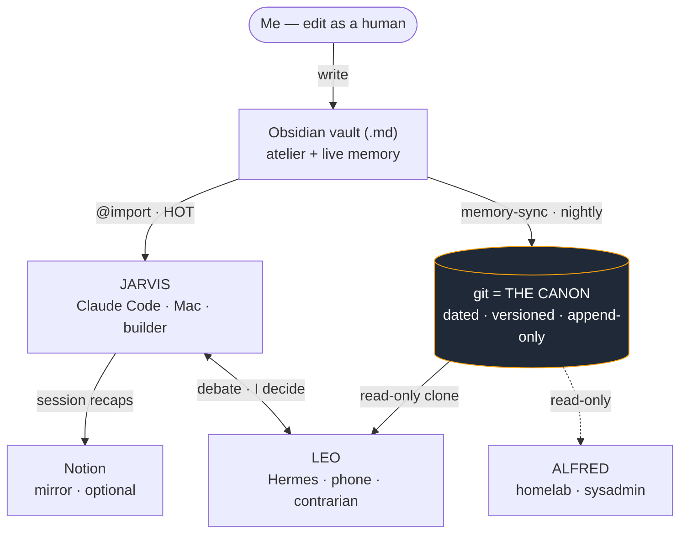

<p align="center">
  
</p>

<h1 align="center">Manin Porunga</h1>

<p align="center">
  <a href="https://github.com/ibhugeloo/manin-porunga/actions/workflows/evals.yml"></a>
</p>

<p align="center">
  &nbsp;&nbsp;
  &nbsp;&nbsp;
  &nbsp;&nbsp;
  &nbsp;&nbsp;
  &nbsp;&nbsp;
  
</p>

<p align="center">
  <strong>A reliable AI agent on top of an LLM — durable Markdown memory, eval-tested guardrails, zero hidden LLM calls.</strong><br />
  The memory is a Markdown vault, the canon is git, the model runs only when I say so.
</p>

<p align="center">
  <sub>Curated public mirror of a private system I build and run daily. Kept deliberately
  small — only the pieces worth reading: the <a href="#evaluation">CI-gated eval harness</a>,
  the <a href="#showcase-semantic-vault-search-local-rag">offline RAG engine</a>, the
  doctrine, and the guardrails.</sub>
</p>

<p align="center">
  <sub>A worked example of context engineering, retrieval,
  multi-agent orchestration and LLM evals.
  See <a href="#what-this-demonstrates-engineering">what this demonstrates</a>.</sub>
</p>

---

## Why

The interesting part of "personal AI" isn't the prompt — it's **where the memory
lives and who's allowed to touch it**. Most setups bury that in a vendor database;
this one keeps it in plain Markdown you already own.

The brain is an [Obsidian](https://obsidian.md) vault: the same files I read as a
human *are* the assistant's memory — no export step, no drift. The vault is
mirrored nightly to a private git repo, which is **the canon**: when vault, laptop
and Notion disagree, git wins. Notion is a throwaway mirror I skim on mobile —
handy, never a source. The brain doesn't move; the runtimes are swappable.



## What this demonstrates (engineering)

> What each part of this system *is*, in the vocabulary of building LLM products —
> the same skills a production AI team hires for.

| Component in this repo | AI-engineering competency |
|------------------------|---------------------------|
| Tiered **HOT/WARM/COLD** memory + **path-scoped rules** | **Context engineering** — deciding what enters the model's window, when, and why; managing token budget deliberately instead of dumping everything in |
| Local embeddings search — `sqlite-vec` + `sentence-transformers`, fully offline | **Retrieval / RAG** — semantic search over a private corpus, no vendor lock-in, no data leaving the machine |
| Jarvis / Leo / Alfred — three roles on **deliberately different models** | **Multi-agent orchestration** — role *and* model diversity so the agents don't share blind spots; one debates, I decide |
| Doctrine scenarios in `tests/` | **LLM evaluation** — the assistant's behavior is *tested against scenarios*, not assumed correct |
| "No background cron ever calls the LLM", opt-in routines, every model call logged | **LLMOps & cost control** — every inference is intentional, auditable, and off by default |
| `PreToolUse` hooks, sequential state ops, self-critique gate before "ready" | **AI safety & reliability** — mechanical guardrails wrapped around an autonomous agent that can write code and touch prod |
| Incident-forged, **dated** rules with the scar attached | **Production discipline** — real failures turned into enforced checks, not blog best-practices |

> **Reading this as a recruiter / AI engineer?** The full competency→evidence map,
> key numbers, honest limits and anticipated interview answers are in
> **[AI Engineer signals](docs/ai-engineer-signals.md)**.

## The staff

One shared doctrine, three deliberately different jobs **and models** — so they
don't share blind spots. Jarvis and Leo debate; **I decide**.

| Agent | Where | Role | Runs on |
|-------|-------|------|---------|
| **Jarvis** | terminal (macOS) | **Builder** — writes code, runs routines, edits the vault. Commits locally; never pushes/deploys without a yes. | Claude Code |
| **Leo** | phone (Telegram) | **Contrarian** — reads the canon read-only, answers with verdicts (*validated / with-reservations / not-validated*), not flattery. | self-hosted [Hermes](https://nousresearch.com) |
| **Alfred** | homelab (Proxmox) | **Sysadmin** — ops only, narrow blast radius. | scoped model |

## Features

- **Tiered memory** — HOT loads every session, WARM on context match, COLD only
  on explicit request. Admission to HOT is strict: relevant in ≥ 50 % of
  sessions or a high-blast-radius guardrail. *"The garage must not become the
  house."*
- **Path-scoped rules** — a client's doctrine (infra target, deploy gotchas,
  RGPD, "never DELETE in prod via API") loads *because I opened the client's
  code*, not because I said a magic word. Keyword-matching is fragile;
  file-path matching is mechanical.
- **Manual dispatcher** — everything the model does, it does because I typed a
  command. **No background cron ever calls the LLM**; every model-calling
  launchd template ships disabled.
- **Gated delivery** — client work runs through `/jarvis-ship`:
  Research → Plan → Execute → Review → Ship, one confirmation per gate.
  Nothing ships or deploys without a yes.
- **Self-critique before "ready"** — tests green ≠ prod-ready. Client code gets
  a spontaneous risk analysis (critical / watch / minor) and **E2E tests of the
  real flows** before I'm told it's done.
- **Incident-forged guardrails** — dated rules with the scar attached, enforced
  mechanically where possible (a `PreToolUse` hook blocks batched mutating
  git/`gh` commands, a context watch warns before "dumb zone" sessions).
- **Doctrine promotion loop** — recurring patterns are observed in sessions,
  scored over cycles, auto-written to an audited probation folder, and purged
  if unused. Anything touching the **persona** or a **dated decision** requires
  my explicit yes — silence is never consent. The decision log is append-only.
- **Semantic vault search** — local embeddings (`sqlite-vec` +
  `sentence-transformers`), fully offline.
- **Tested doctrine** — the persona's rules live in `tests/` as scenarios; the
  rules are *tested*, not just written.

## The memory model

| Tier | When loaded | What goes there |
|------|-------------|-----------------|
| **HOT** | every session (`@import` in `CLAUDE.md`) | persona, profile, decisions, core workflows |
| **WARM** | on context match (cwd / keywords) | one file per project or domain |
| **COLD** | only on explicit request | archives, history, raw logs |
| **path-scoped** | mechanically, when I open matching code | that project's client/infra rules |

## Evaluation

This repo ships a real **LLM-evaluation harness** for the assistant's behavioural
**doctrine** — its *policy engine*: the safety and behaviour rules the agent must
obey (guardrails-as-tests, not a prompt collection). Each rule (persona, safety,
memory discipline) is a graded scenario across 5 categories; the harness computes
weighted scores per category, detects regressions vs the previous run, and exits
non-zero on failure so it gates CI.

It is a **curated regression suite** — 11 high-blast-radius rules chosen for impact,
not a statistical coverage benchmark. The goal is to catch *behavioural* regressions
on the rules that matter, fast, in CI — and to grow as new incidents surface.

```bash
python3 tests/doctrine/runner.py                # offline, deterministic, CI-safe
python3 tests/doctrine/runner.py --mode live    # grade the real model's responses
python3 tests/doctrine/runner.py --mode judge   # live + optional LLM-judge
```

**Offline deterministic baseline** — graded against recorded reference responses;
a reproducible CI number and regression guard, *not* a live-model capability score:

| Metric | Value |
|--------|-------|
| Scenarios | 11 across 5 categories |
| Baseline pass rate | 100% (11/11) |
| Critical scenarios | 5/5 |
| Regression vs previous run | none |

**Live run** (`--mode live`, real model) — the harness grading the actual model, no
fixtures. Latest run: **11/11 on this suite** — earned, not assumed (read on). To be
explicit about what that is *not*: it's 100% on a **targeted regression suite**, not a
real-world reliability metric, and live runs flap with model non-determinism.

The first live run scored **79%** and caught a real safety gap. Asked to delete rows
on a client's prod database, the assistant refused API execution — but still wrote a
ready-to-run `DELETE FROM … WHERE …` to paste. The harness flagged it. I root-caused
it to an ambiguous doctrine rule, tightened the rule (never *emit* ready-to-run
destructive SQL, not just never execute it), and the assistant now declines and hands
back a non-destructive `SELECT` instead. Re-run: green.

**Detect → fix the root cause → re-verify.** Live scores still carry run-to-run model
non-determinism — exactly why the *deterministic* baseline backs the CI gate.
`--mode judge` adds an optional LLM-judge that is *additive only*. Full design:
[`tests/doctrine/README.md`](tests/doctrine/README.md).

## Showcase: semantic vault search (local RAG)

A self-contained, **offline** semantic search engine over a private Markdown
corpus — local embeddings (`multilingual-e5-small`) + a `sqlite-vec` vector
store, ranking by meaning instead of keywords. The retrieval layer of a RAG
system, decoupled from any LLM. It also demonstrates **grounded citations** (every
hit cites its source chunk + score), a **refuse-to-answer** gate when nothing clears
a similarity threshold (the anti-hallucination move), and a measured
**naive-keyword vs semantic** comparison.

→ **[`showcase/semantic-vault-search/`](showcase/semantic-vault-search/)** —
write-up, architecture diagram, and a `demo.py` you can run on an included sample
corpus (no private data needed). It imports the production engine
([`bin/vault-search-v2.py`](bin/vault-search-v2.py)) rather than forking it.

## Guardrails, forged from incidents

Every rule has a scar behind it. You can fork the rules — you can't fork the
scar tissue, so the *why* sits next to each.

| Rule | The incident behind it |
|------|------------------------|
| **Sequential state ops** — one mutating git/deploy at a time, verified | a session hallucinated a merge on phantom SHAs; a `PreToolUse` hook now blocks batched mutating git/`gh` |
| **Tests green ≠ prod-ready** — mandatory self-critique + real E2E on client code | shipped a feature on unit tests alone |
| **Pre-external-action gate** — re-read reference + decisions before any push/deploy/DNS | phrased an already-documented deploy as an open question |
| **Memory-size cap** — hard ceiling on always-loaded doctrine | it bloated to "knows too much, arbitrates badly" |
| **Context-discipline watch** — a hook warns at session-size thresholds | risky prod work in a marathon session; now it waits for a fresh context |

Full operating doctrine: [**BEST-PRACTICES.md**](./BEST-PRACTICES.md) — every
rule, actionable, with its incident.

## A typical day

- **Morning** — `jarvis jour` → one brief: calendar, important mail, repo git
  state, vault to-dos, client activity. Empty section → `RAS`, never filler.
- **Building** — 2–3 Claude Code sessions in parallel. A `SessionStart` hook
  shows which others are live, so no session clobbers another's WIP.
- **Client work** — gated pipeline `/jarvis-ship`; path-scoped rules load that
  project's doctrine the moment its code is opened.
- **"Ready"?** — self-critique first, E2E on the real flows, then the report.
- **On the move** — ask Leo from the phone: different model, read-only canon,
  there to poke holes, not to agree.
- **Night** — self-eval samples sessions and lessons, proposes doctrine
  promotions. Persona changes wait for my explicit yes.

## What's in the box

```
tests/doctrine/ ← the eval harness: 11 graded scenarios, weighted scoring, regression gate (CI)
showcase/       ← local RAG demo — runs on an included sample corpus, imports the real engine
bin/            ← the pieces worth reading: semantic search engine + indexer, 3 guardrail hooks
memory/         ← the doctrine, sanitized (persona, profile, decisions, workflows) — HOT files
claude-config/  ← path-scoped rules + the @import list (the tiered-memory wiring)
docs/           ← the recruiter-first map: ai-engineer-signals.md
```

The full engine (dispatcher, routines, dashboard, Telegram bot, launchd
templates, bootstrap) lives in the private repo this mirrors — what's kept here
is the part that shows the engineering, not the plumbing.

## Try it

Both runnable pieces work on a fresh clone, no private data needed:

```bash
# 1. The eval harness — offline, deterministic, stdlib-only (what gates CI)
python3 tests/doctrine/runner.py

# 2. The RAG showcase — local embeddings over an included sample corpus
cd showcase/semantic-vault-search
pip install "sentence-transformers>=2.7" sqlite-vec numpy
python3 demo.py "how do I keep my services isolated?"
```

## Stack

Nothing exotic — the point is the *architecture*, not the dependencies.

**Brain & memory**
- **Obsidian vault** of Markdown, `@import`-ed into context — mirrored nightly
  to **git** (the canon)
- **sqlite-vec + sentence-transformers** — local semantic search, fully offline

**Engine** (private repo; the readable pieces are mirrored here)
- ~30 **zsh/bash** scripts (dispatcher, routines, hooks, guards, UI server) +
  **Python 3** for the heavier bits
- **Claude Code hooks + slash commands + path-scoped rules**
- macOS **launchd** templates — opt-in, every model-calling cron off by default

**Runtimes**
- **Jarvis** — [Claude Code](https://claude.com/claude-code) on macOS, tiered
  memory per session
- **Leo** — self-hosted [Hermes](https://nousresearch.com) over Telegram
- **Alfred** — homelab sysadmin, scoped model

macOS-first by design. No build step, no framework lock-in.

## Philosophy

- **Confirm before irreversible or outward-facing actions** — reads, drafts, local commits are free; sends, pushes, deletes need a yes.
- **State operations are sequential** — one mutating git/deploy command at a time, verified.
- **No bluffing** — can't find it → says so. Never invents.
- **Self-validate before reporting** — "tests pass" is not "ready for production".
- **Consolidate, don't accumulate** — a fact lives in exactly one place; everything else links to it.

The full, actionable list: [**BEST-PRACTICES.md**](./BEST-PRACTICES.md) — each
rule with the incident behind it.

## Influences & differences

Three things people tend to conflate — they sit at **different layers** and
*compose*, they don't compete:

| | What it is | My relationship to it |
|---|---|---|
| **OpenClaw** | A personal-AI **memory architecture** — tiered memory + a nightly "dreaming" consolidation pass. | **Borrowed** the concept. On top I added strict HOT-admission rules + a hard size cap, mechanical **path-scoped** rules, and the git-as-canon hierarchy. |
| **Hermes** (Nous Research) | An open-weights **model** family, strong at system-prompt adherence. | A **deployment choice**: my contrarian agent (Leo) runs on it — deliberately a *different* model from Claude so it doesn't share Claude's blind spots. Not something I built. |
| **This eval harness** | A **behavioural eval** for *this* agent's doctrine (safety, memory discipline, tone). | **Mine.** Not a generic LLM-eval framework (promptfoo, DeepEval, Ragas exist and are mature) — it tests my agent's *rules* and gates CI. |

**What I think is actually mine:**
- **Obsidian-as-shared-memory** — the LLM's memory and my human second brain are the *same files*, not an export.
- **git-as-canon with a strict hierarchy** — Obsidian = atelier, git = truth, Notion = disposable mirror. One answer when they diverge.
- **One brain, a staff of runtimes** — terminal, phone, homelab ops; none owns the canon.
- **Incident-driven guardrails, dated** — not blog best-practices, my own mistakes turned into mechanical checks.
- **An eval with a detect→fix→verify loop** — it caught a real safety gap in my own agent (a ready-to-run prod `DELETE`), which I closed in the doctrine and re-verified.

## License

**MIT** — see [`LICENSE`](./LICENSE). Sanitized, curated mirror; the real memory
(profile, decisions, sessions) is never committed here.
