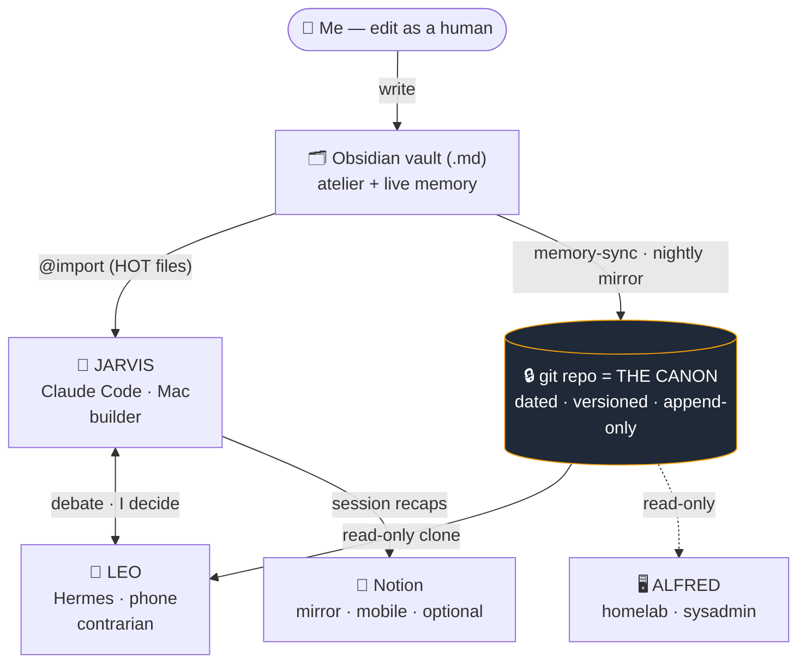
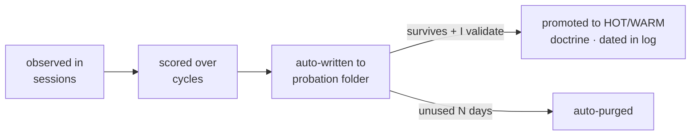

# 🤖 manin-jarvis

I run a small staff of AI assistants off a single brain. One builds in my terminal,
one argues back from my phone, one runs my servers. The brain is a folder of Markdown —
an Obsidian vault, versioned in git. This repo is that brain's engine and doctrine,
sanitized so you can fork it.

> **Sanitized template.** The structure of an assistant I drive every day — personal
> content stripped, replaced by fill-in-the-blank templates. Make it yours.

---

## The actual idea: one brain, many runtimes

Most "personal AI" is a system prompt and a prayer. The interesting part isn't the prompt —
it's **where the memory lives and who's allowed to touch it.**

The memory is an **Obsidian vault**. The same `.md` files I read and edit as a human second
brain are `@import`-ed into the assistant's context. One source, two readers: me and the model.
There's no separate "AI memory" to keep in sync — I edit a note, the assistant knows.

That vault is mirrored nightly to **git**, which is the **canon**. When the vault, a laptop,
and Notion disagree, git wins. Everything else is a consumer of that canon:



The brain doesn't move. The runtimes are swappable.

---

## The staff

Three assistants, one shared doctrine, deliberately different jobs and different models so
they don't share blind spots:

- **Jarvis** — Claude Code in my terminal (macOS). The builder: writes code, runs routines,
  edits the vault. Loads the full HOT memory every session. Drafts and commits locally; never
  pushes or deploys without a yes.
- **Leo** — a self-hosted [Nous Research **Hermes**](https://nousresearch.com) agent in my
  homelab, reachable over **Telegram**. My **portable second brain when I'm away from my desk**,
  and a deliberate **contrarian**: it reads the git canon **read-only** and challenges Jarvis's
  takes. It answers with verdicts — *validated / validated-with-reservations / not-validated* —
  not flattery. Jarvis and Leo debate; I decide.
- **Alfred** — a scoped sysadmin for the homelab (Proxmox). Narrow blast radius, ops only.

A separate cockpit, [`thousand-sunny`](https://github.com/ibhugeloo/thousand-sunny), drives
them in parallel — each in its own colored terminal session.

---

## How I actually work

### Memory is a vault, not a config file

I write everything where I'd write it anyway: an Obsidian vault. Profile, dated decisions,
project notes, doctrine, aspirations. Wikilinks between facts. The exact same files are the
assistant's memory — loaded by tier (below), not dumped wholesale. Editing my second brain
*is* editing the AI's brain. No export step, no drift.

A nightly `memory-sync` copies the vault into a private git repo (secrets excluded by an
allow-list, never a deny-list). **That git history is the canon** — it's what Leo reads, what
gets reviewed, and what survives a wiped machine. Obsidian is the workshop; git is the record;
Notion is a throwaway mirror I skim on mobile, plus a paper-trail where session recaps land
automatically when I close a session.

### Nothing runs the LLM behind my back

I killed every background cron that silently called the model — they bloated my context and my
bill with zero transparency. Everything now runs through a **manual dispatcher**: `jarvis jour`
(morning brief), `jarvis watchtower` (prod health), `jarvis finance` (earnings), `jarvis eval`
(self-review), and so on. The model runs **when I say so**. A couple of local, non-LLM jobs are
the only exceptions (vault indexing, the Telegram gateway, mirroring).

A typical day:

1. **Morning** — `jarvis jour` pulls calendar, unread-important mail, my supervised repos'
   git state, vault to-dos, and client activity into one actionable brief. Empty section →
   it writes `RAS`, never invents filler.
2. **Building** — often 2–3 Claude Code sessions in parallel (desktop + laptop). A
   `SessionStart` hook injects which other sessions are live, so I don't clobber another
   session's work-in-progress.
3. **Client work** runs through a **gated pipeline** (`/jarvis-ship`): Research → Plan →
   Execute → Review → Ship, with an explicit stop between each phase. When I open a client's
   code, **path-scoped rules** (`.claude/rules/*.md`) load *that project's* doctrine
   mechanically — infra target, deploy gotchas, RGPD constraints, "never DELETE in prod via
   API" — so the right guardrails are present exactly when I'm in that codebase.
4. **Before I call anything "ready"** — on any code that touches a paying client, the
   assistant must self-criticize *first*: list what can break (🔴 critical / 🟡 watch /
   🟢 minor), fix what's fixable now, and never confuse "typecheck + unit tests green" with
   "production-ready." Client projects don't ship without **E2E tests** of the real flows.
5. **On the move** — I ask Leo from my phone. Different model, read-only on the canon, there to
   poke holes, not to agree.
6. **Night** — a self-evaluation routine samples recent sessions and my own lessons file,
   detects recurring patterns, and proposes promotions into the permanent doctrine. A nightly
   "dreaming" pass consolidates. **Promotions to persona files need my explicit yes** — silence
   is never consent.

That client pipeline (step 3) is gated end to end — I confirm each phase before the next, and
nothing ships or deploys without an explicit yes:


### How a habit becomes doctrine

This is the loop that keeps the brain from rotting:



Low-risk skills auto-write themselves into an audited probation folder. Anything that changes
the *persona* or a *dated decision* requires my explicit approval. The decision log is
**append-only**: revising a choice means a new dated entry, never rewriting history — so the
assistant can always detect when a new idea contradicts a past one and stop me.

---

## The memory model

| Tier | When loaded | What goes there |
|------|-------------|-----------------|
| 🔥 HOT | every session (`@import` in `CLAUDE.md`) | persona, profile, decisions, core workflows |
| 🌤️ WARM | on context match (cwd / keywords) | one file per project or domain |
| 🧊 COLD | only on explicit request | archives, history, raw logs |
| 📌 path-scoped | mechanically, when I open matching code | that project's client/infra rules |

Admission to HOT is strict: only what's relevant in ≥ 50 % of sessions, or high blast-radius
(a prod guardrail). Everything else stays WARM, loaded on demand. *"The garage must not become
the house."* The path-scoped tier exists because keyword-matching is fragile — I want the
client's rules loaded *because I opened the client's code*, not because I happened to say a
magic word.

---

## Guardrails, forged from incidents

Every rule here has a scar behind it. A few, dated in the log:

- **Sequential state operations.** One mutating git/deploy command at a time, verified before
  the next — after a session hallucinated a merge and built analysis on phantom SHAs. A
  `PreToolUse` hook now mechanically blocks batched mutating git/`gh` commands.
- **"Tests green ≠ prod-ready."** Mandatory self-critique + real E2E on client code — after I
  shipped a feature on unit tests alone and the real integration was never exercised.
- **The pre-external-action gate.** Before recommending any push/deploy/DNS change, re-read the
  project's reference + decisions — after I phrased a deploy as an open question when the answer
  was already documented in HOT memory.
- **A memory-size cap.** A hard ceiling on the always-loaded doctrine — after it bloated to the
  point of "knows too much, arbitrates badly." Consolidate, don't accumulate.
- **A context-discipline watch.** A hook warns at session-size thresholds to avoid the
  "dumb zone" of long marathon sessions; risky prod work waits for a fresh context.

You can fork the rules. You can't fork the scar tissue — so the *why* is written next to each.

---

## Influences — and what's different

Honest credit, because building in public means owning what you borrowed:

- **OpenClaw** — the tiered memory and the nightly "dreaming" consolidation pass.
- **Nous Research / Hermes** — the self-hosted, portable, contrarian agent (Leo runs on it).

What I think is actually mine:

- **Obsidian-as-shared-memory** — the LLM's memory and my human second brain are the *same
  files*, not an export or a sync target.
- **git-as-canon with a strict hierarchy** — Obsidian = atelier, git = truth, Notion =
  disposable mirror. One answer when they diverge.
- **One brain, a staff of runtimes** — terminal (Claude Code), phone (Hermes), homelab ops;
  none of them owns the canon.
- **Incident-driven guardrails, dated in the log** — the rules aren't best-practices copied
  from a blog, they're my own mistakes turned into mechanical checks.

---

## What's in the box

```
memory/      ← the doctrine (persona, profile, decisions, dreams, workflows) — HOT files
share/       ← prompts for each routine (brief, weekly, eval, watchtower, finance…) + missions
bin/         ← the engine: dispatcher, semantic vault search, routines, hooks, guards, UI server
claude-config/← Claude Code hooks + slash commands + path-scoped rules + the @import list
docs/        ← how each subsystem works (one doc per subsystem)
config/      ← per-project config (watchtower, finance…) — *.example.yaml here
LaunchAgents/← macOS launchd templates for the scheduled routines (opt-in)
mos/         ← Mission OS: bounded tasks with state (FastAPI + SQLite)
tests/       ← doctrine scenarios — the persona's rules are *tested*, not just written
```

---

## Getting started

Two paths below. If you write code, jump to **For developers**. If you don't — or your
friend doesn't — follow **The gentle path**. It gets you a working butler in your terminal
that remembers you, *without* the phone/server parts (those are advanced).

> **Real talk before you start.** This runs on a **Mac**, needs a **paid Anthropic account**
> (Claude Code), and you'll **copy-paste a few Terminal commands**. If you've never opened
> Terminal, that's fine — just follow exactly, and budget ~45 minutes. You do **not** need
> Leo (the phone agent), Alfred, a homelab, or any routine to start. Ignore all of that for now.

### The gentle path (no coding required, macOS)

**What you'll have at the end:** you type `claude` in a folder, and your assistant already
knows who you are, your tone rules, and remembers things between conversations.

**1. Install the two apps**
- [Obsidian](https://obsidian.md) — a free note-taking app. This becomes your assistant's
  memory (and yours). Install it like any app.
- [Claude Code](https://claude.com/claude-code) — Anthropic's assistant for your terminal.
  Follow their installer and sign in (this is the paid part).

**2. Download this template (no git needed)**
- On this page, click the green **`Code`** button → **Download ZIP**.
- Unzip it. Move the folder somewhere you'll find again, e.g. your **Documents** folder.
- Rename it to something simple like `my-jarvis` if you want.

**3. Open Terminal in that folder**
- In Finder, right-click the folder → **Services** → **New Terminal at Folder**.
  (A black window opens — that's Terminal. You'll paste two commands into it.)

**4. Turn the blank templates into your files**
Copy this, paste it into Terminal, press Enter (no need to understand it):
```bash
for f in memory/*.example.md;   do cp "$f" "${f%.example.md}.md"; done
for f in config/*.example.yaml; do cp "$f" "${f%.example.yaml}.yaml"; done
```
This just makes editable copies of the example files.

**5. Make it *yours* (the important part — and the easy part)**
- Open Obsidian → **Open folder as vault** → pick your `my-jarvis` folder.
- Edit two files, in plain words:
  - `memory/jarvis_soul.md` — how you want it to talk to you (formal? casual? blunt?), and
    how much it's allowed to do on its own vs. ask you first.
  - `memory/profil.md` — who you are: your work, your goals, your preferences, what to never
    forget. Write it like you'd brief a new personal assistant.
- The more honest and specific you are here, the better it gets. This is the part no software
  can do for you.

**6. Switch it on**
Back in Terminal, paste this and press Enter:
```bash
./bootstrap.sh
```
This wires your files into Claude Code (safe to read first if you're curious — it's just
setup). Then start it:
```bash
claude
```
Say hi. Ask it *"what do you know about me?"* — it should answer from your profile. 🎉

**7. Grow into it, slowly**
Don't turn on anything else yet. Use it by hand for a week or two. When you catch yourself
wishing it did something on a schedule (a morning brief, etc.), *then* turn on that one
routine. The phone agent (Leo), the sysadmin (Alfred) and the homelab setup are **advanced
add-ons** — open [`docs/`](./docs) only when you actually want them.

### For developers

```bash
git clone https://github.com/ibhugeloo/manin-jarvis.git
cd manin-jarvis
for f in memory/*.example.md;   do cp "$f" "${f%.example.md}.md"; done
for f in config/*.example.yaml; do cp "$f" "${f%.example.yaml}.yaml"; done
# Fill in memory/*.md + config/*.yaml, point @imports at your vault path:
./bootstrap.sh
```
`bootstrap.sh` symlinks `bin/` into `~/.local/bin`, wires the Claude Code hooks, and
(optionally) installs the launchd routines. Idempotent — re-run to update.

> **Not on a Mac?** The engine assumes macOS (launchd, `~/.local/bin`, shell hooks). Linux
> works with minor tweaks; Windows needs WSL — both are advanced and undocumented for now.

---

## Philosophy

- **Confirm before irreversible or outward-facing actions.** Reads, drafts, local commits are
  free; sends, pushes, deletes need a yes.
- **State operations are sequential.** One mutating git/deploy command at a time, verified.
- **No bluffing.** Can't find it → says so. Never invents.
- **Self-validate before reporting.** "Tests pass" is not "ready for production."
- **Consolidate, don't accumulate.** A fact lives in exactly one place; everything else links to it.

---

## License

MIT — see [`LICENSE`](./LICENSE). Sanitized reference; the real memory (profile, decisions,
sessions) is never committed. Keep your filled-in `*.md` / `*.yaml` out of any public repo.
