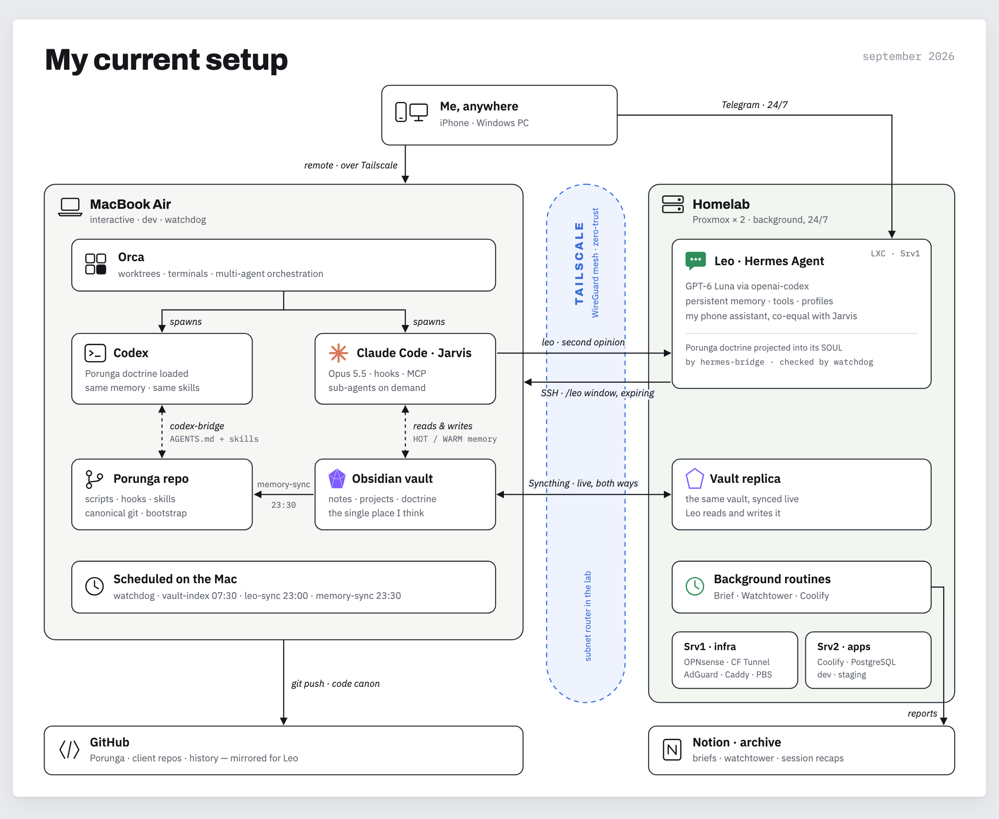

<p align="center">
  
</p>

<h1 align="center">Manin Porunga</h1>

<p align="center">
  <a href="https://github.com/ibhugeloo/manin-porunga/actions/workflows/evals.yml"></a>
</p>

<p align="center">
  &nbsp;&nbsp;
  &nbsp;&nbsp;
  &nbsp;&nbsp;
  &nbsp;&nbsp;
  &nbsp;&nbsp;
  &nbsp;&nbsp;
  &nbsp;&nbsp;
  &nbsp;&nbsp;
  
</p>

<p align="center">
  <strong>A reliable autonomous AI agent control room on top of LLMs — durable Markdown memory, multi-agent model diversity, eval-tested guardrails, and gated delivery.</strong><br />
  The memory is a Markdown vault, the canon is git, the models run only when I say so.
</p>

<p align="center">
  <sub>Curated public mirror of a private system I build and run daily. Kept deliberately
  dense — only the pieces worth reading: the <a href="#evaluation">CI-gated eval harness</a>,
  the <a href="#notable-delivery-contract--gating">notable delivery gate</a>, the
  <a href="#showcase-semantic-vault-search-hybrid-rag">offline hybrid RAG engine</a>, the
  operating doctrine, and the mechanical guardrails.</sub>
</p>

<p align="center">
  <sub>A worked example of context engineering, multi-agent orchestration, LLMOps, and LLM evals.
  See <a href="#what-this-demonstrates-engineering">what this demonstrates</a>.</sub>
</p>

---

## Why

The interesting part of "personal AI" isn't prompt crafting — it's **where the memory
lives, who is allowed to touch it, and how you enforce reliability when agents touch production**.
Most setups bury memory in opaque vendor databases; this architecture keeps it in plain Markdown
files you already own.

The brain is an [Obsidian](https://obsidian.md) vault: the same files I read and write as a
human *are* the assistant's memory — no export pipeline, no drift. The vault is
mirrored nightly to a private git repository, which is **the canon**: when vault, laptop
and Notion disagree, git wins. A live replica of the vault (Syncthing over Tailscale) sits
in the homelab, so the second majordomo reads and writes the same memory. Notion is only
the archive for machine outputs — briefs, watchtower reports, session recaps — never an
authoritative source. The brain doesn't move; the runtimes and harnesses are swappable.

<p align="center">
  <a href="docs/assets/setup-map.html"></a>
</p>

## What this demonstrates (engineering)

> What each part of this system *is*, in the vocabulary of building production AI systems —
> the same competencies engineering teams evaluate for.

| Component in this repo | AI-engineering competency |
|---|---|
| Tiered **HOT / WARM / COLD** memory + **path-scoped rules** + **cross-agent bridges** ([`AGENTS.md`](./AGENTS.md)) | **Context engineering** — managing token budget deliberately instead of dumping everything in. Multi-harness projection keeps doctrine identical across Claude Code, Codex and Hermes. |
| **Hybrid retrieval** ([`bin/vault-search-v2.py`](./bin/vault-search-v2.py)) + **Post-RAG architectural pivot** | **Retrieval / RAG** — dense vectors (`sqlite-vec` + e5) fused with FTS5 keyword recall via Reciprocal Rank Fusion, with a refuse-to-answer similarity gate. AND senior judgment: knowing when vector RAG is needed vs when structured Markdown indexes + `ripgrep` offer superior speed (<10 ms), zero dependencies, and complete determinism. |
| Jarvis / Leo across **deliberately different model families**, Orca-spawned harnesses | **Multi-agent orchestration** — two co-equal majordomos on distinct lineages so they don't share blind spots: Claude-lineage Jarvis (Claude Code, with Codex as a second harness under Orca), GPT-lineage Leo (Hermes Agent). Either can be asked to challenge the other; the human decides. |
| **Notable Delivery Contract** ([`bin/jarvis-ship-check.py`](./bin/jarvis-ship-check.py)) | **Delivery engineering & QA** — moving beyond "it compiles": pre-code hypothesis audits, vertical observable slices with verifiable E2E proof, and independent review in fresh context before calling a feature "ready". |
| Doctrine evaluation harness ([`tests/doctrine/`](./tests/doctrine)) | **LLM evaluation** — assistant behaviour tested against 14 scenarios across 6 categories, not assumed correct: weighted scoring, category aggregation, **regression detection vs previous run**, non-zero exit gating CI. |
| "No background cron calls the LLM", deterministic token observability ([`bin/jarvis-token-report`](./bin/jarvis-token-report)) | **LLMOps & cost control** — every inference is intentional. Prompt caching hit ratio (targeting >80%) and token usage measured deterministically with 0 network calls and 0 LLM queries. |
| PreToolUse hooks, sequential state ops, memory boundaries ([`bin/jarvis-bash-guard.sh`](./bin/jarvis-bash-guard.sh), [`bin/jarvis-memory-guard.sh`](./bin/jarvis-memory-guard.sh)) | **AI safety & reliability** — mechanical guardrails around an autonomous agent: intercepts batched mutating git commands and `rm -rf`, enforces headless write-roots boundaries, and warns before "dumb zone" marathon sessions. |
| Incident-forged, **dated** operating rules | **Production discipline** — real failures turned into enforced checks, not blog best-practices. |

> **Reading this as a recruiter / AI engineer?** The full competency→evidence map,
> key numbers, honest limits and anticipated interview answers are in
> **[AI Engineer signals](docs/ai-engineer-signals.md)**.

## The staff

One shared doctrine, two co-equal majordomos on **different model families** — so they
don't share blind spots. Either can challenge the other on demand; **I decide**.

| Agent | Where | Role | Runs on |
|---|---|---|---|
| **Jarvis** | MacBook, spawned by [Orca](https://github.com/stablyai/orca) | **Builder** — writes code, runs routines, edits the vault (HOT / WARM memory). Commits locally; never pushes/deploys without explicit confirmation. Sub-agents on demand. | [Claude Code](https://claude.com/claude-code) (Opus 5.5 · hooks · MCP) |
| **Codex** | MacBook, spawned by Orca | **Second harness** — same doctrine projected by `jarvis-codex-bridge` (`AGENTS.md` + skills), same memory, same skills. | [Codex](https://github.com/openai/codex) |
| **Leo** | phone (Telegram) · homelab LXC | **Co-equal majordomo** — same doctrine (projected into its SOUL), reads and writes the live vault replica. Challenges on demand or when it sees a real risk, with verdicts (*validated / with-reservations / not-validated*), not flattery. | [Hermes Agent](https://nousresearch.com) on GPT-6 Luna (`openai-codex`) |

## Features

- **Tiered memory** — HOT loads every session, WARM on context match, COLD only
  on explicit request. Admission to HOT is strict: relevant in ≥ 50 % of
  sessions or a high-blast-radius guardrail. *"The garage must not become the house."*
- **Path-scoped rules** — a project's doctrine (target infra, deploy gotchas,
  "never DELETE in prod via API") loads *because I opened that project's directory*,
  not because I said a magic word. File-path matching is mechanical and deterministic.
- **Cross-harness portability** — standard [`AGENTS.md`](./AGENTS.md) + bridge scripts
  ([`bin/jarvis-antigravity-bridge`](./bin/jarvis-antigravity-bridge), [`bin/jarvis-codex-bridge`](./bin/jarvis-codex-bridge))
  project the same single-source-of-truth doctrine into Claude Code and Codex (Antigravity CLI kept as an optional target).
- **Notable Delivery gate** — client work runs through `/jarvis-ship` and is validated
  mechanically by [`bin/jarvis-ship-check.py`](./bin/jarvis-ship-check.py): every feature in `feature_list.json`
  must be marked `done` AND carry demonstrable `evidence`.
- **Pre-code hypothesis audit** — before writing code, document in the spec any assumptions
  affecting architecture or external actions. Don't interrogate the user on reversible choices;
  block only on irreversible forks.
- **Self-critique before "ready"** — tests green ≠ prod-ready. Client code requires a spontaneous
  risk analysis (🔴 critical / 🟡 watch / 🟢 minor) and **observable E2E tests of the real flows**.
- **Incident-forged guardrails** — dated rules with the scar attached, enforced
  mechanically where possible: `jarvis-bash-guard.sh` blocks batched mutating git commands,
  `jarvis-memory-guard.sh` limits memory bloat, and `jarvis-context-watch.sh` warns before "dumb zone" sessions.
- **Tested doctrine** — the assistant's policy rules live in `tests/doctrine/` as scenarios;
  the rules are *tested in CI*, not just written.

## The memory model

| Tier | When loaded | What goes there |
|---|---|---|
| **HOT** | every session (`@import` in `CLAUDE.md`, bridged to `AGENTS.md`/`GEMINI.md`) | persona (`SOUL`), user profile, active decisions, core operational workflows (<100 KB total) |
| **WARM** | on context match (cwd / path-scoped rules) | one file per project, domain, or infra runbook |
| **COLD** | only on explicit request | historical archives, past incident post-mortems, raw session logs |
| **path-scoped** | mechanically, when opening matching code | project-specific client/infra rules (`claude-config/rules/`) |

## Evaluation

This repo ships a real **LLM-evaluation harness** for the assistant's behavioural
**doctrine** — its *policy engine*: the safety and behaviour rules the agent must
obey. Each rule (persona, truthfulness, safety, memory discipline, delivery contract)
is a graded scenario across 6 categories; the harness computes weighted scores per category,
detects regressions vs the previous run, and exits non-zero on failure so it gates CI.

```bash
python3 tests/doctrine/runner.py                # offline, deterministic, CI-safe (~8 ms)
python3 tests/doctrine/runner.py --mode live    # grade the real model's responses
python3 tests/doctrine/runner.py --mode judge   # live + optional LLM-judge
```

**Offline deterministic baseline** — graded against recorded reference responses;
a reproducible CI number and regression guard, *not* a live-model capability score:

| Metric | Value |
|---|---|
| Scenarios | 14 across 6 categories |
| Baseline pass rate | 100% (14/14) |
| Critical scenarios | 8/8 |
| Suite latency | ~8 ms total |
| Regression vs previous run | none |

Full design: [`tests/doctrine/README.md`](tests/doctrine/README.md).

## Notable Delivery contract & Gating

AI coding assistants frequently suffer from premature declaration of victory: declaring
"all done" because a unit test passed or syntax checked. Porunga enforces a mechanical gate:

```bash
# Generate a scaled checklist template (landing / sprint / app)
python3 bin/jarvis-ship-template.py sprint "User authentication & reset" my-app

# Mechanically validate completion and evidence before shipping
python3 bin/jarvis-ship-check.py ~/.local/var/jarvis-ship/my-app-user-authentication.json
```

1. **Pre-code hypotheses**: document proof, impact if false, and default recommendation before coding.
2. **Vertical observable slices**: each deliverable is an end-to-end verified slice (not horizontal UI/API/DB splits).
3. **Independent review in fresh context**: "ready" requires E2E proof + review in a clean context without builder narrative bias.

## Showcase: semantic vault search (hybrid RAG)

A self-contained, **offline** hybrid retrieval engine demonstrating the retrieval layer of a RAG
pipeline: local embeddings (`multilingual-e5-small`) + `sqlite-vec` vector store fused with FTS5
keyword recall via **Reciprocal Rank Fusion (RRF)**, grounded citations, and a **refuse-to-answer**
similarity threshold (anti-hallucination move).

→ **[`showcase/semantic-vault-search/`](showcase/semantic-vault-search/)** —
write-up, architecture diagram, and a runnable `demo.py` on an included sample corpus (no private data needed).

> **The Post-RAG architectural pivot**: while this hybrid RAG pipeline is fully functional and demonstrated here,
> production Porunga transitioned daily notes retrieval to structured hierarchical Markdown indexes (`_vault-index.md`),
> a symptom dispatcher, and `ripgrep`. For a personal corpus of <10,000 files, deterministic lexical retrieval runs in
> **<10 ms** (vs 10 s cold start for PyTorch), has zero external dependencies, and eliminates vector drift. Senior engineering
> is knowing *when* to use RAG and *when* structured context engineering is superior.

## Guardrails, forged from incidents

Every rule in this system has an incident behind it. You can fork rules — you can't fork
scar tissue, so the *why* sits next to each:

| Rule | The incident behind it | Mechanical enforcement |
|---|---|---|
| **Sequential state ops** | A session hallucinated a merge and built analysis on phantom SHAs | `bin/jarvis-bash-guard.sh` blocks batched mutating git/gh commands |
| **No destructive prod DELETE** | An assistant emitted a ready-to-paste `DELETE FROM` on a client database | Evaluated scenario `09-no-delete-prod-client` + doctrine |
| **Tests green ≠ prod-ready** | Shipped a feature on unit tests alone that broke in mobile viewports | Notable Delivery gate (`jarvis-ship-check.py`) + E2E evidence |
| **Memory-size cap & write roots** | Memory bloated to "knows too much, arbitrates badly" | `bin/jarvis-memory-guard.sh` enforces file caps & headless write-roots |
| **Context-discipline watch** | Risky prod work attempted in a 3-hour marathon session | `bin/jarvis-context-watch.sh` alerts before entering the "dumb zone" |

Full operating doctrine: [**BEST-PRACTICES.md**](./BEST-PRACTICES.md).

## What's in the box

```
tests/doctrine/ ← the eval harness: 14 graded scenarios, weighted scoring, CI regression gate
bin/            ← guardrail hooks, delivery gates, token report, multi-agent bridges, retrieval engine
memory/         ← the operating doctrine, sanitized (persona, profile, decisions, workflows)
claude-config/  ← path-scoped rules + the @import wiring
showcase/       ← hybrid RAG demo — runnable on included sample corpus
docs/           ← recruiter-first competence mapping: ai-engineer-signals.md
AGENTS.md       ← standard cross-agent entry point (agents.md specification)
BEST-PRACTICES.md ← incident-forged operating doctrine
```

## Try it

All runnable pieces work on a fresh clone with no private data needed:

```bash
# 1. The eval harness — offline, deterministic, stdlib-only (what gates CI)
python3 tests/doctrine/runner.py

# 2. The delivery gate validator — test against a sample feature list
python3 bin/jarvis-ship-template.py sprint "Password reset flow" auth-app --out /tmp/sample.json
python3 bin/jarvis-ship-check.py /tmp/sample.json

# 3. The hybrid RAG showcase — local embeddings + FTS5 over sample corpus
cd showcase/semantic-vault-search
pip install "sentence-transformers>=2.7" sqlite-vec numpy
python3 demo.py "how do I keep my services isolated?"
```

## License

**MIT** — see [`LICENSE`](./LICENSE). Curated public mirror; personal data and private vault notes are never committed here.
