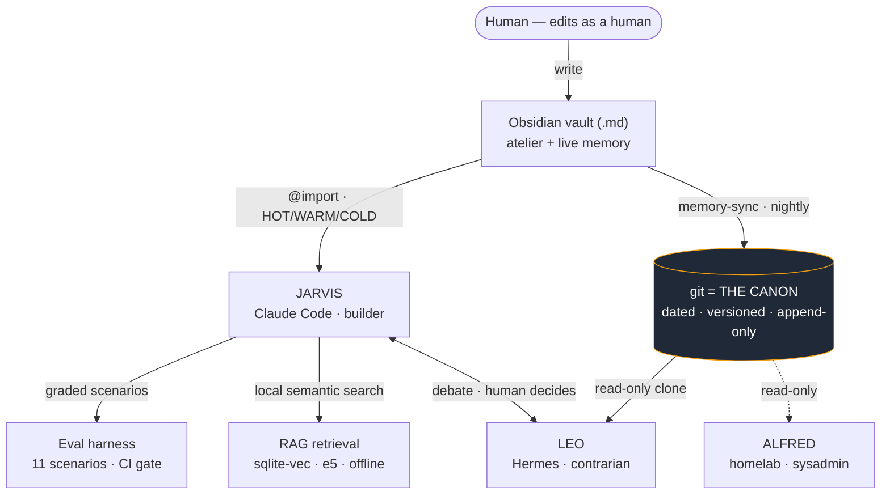

# AI Engineer signals

> **One-line pitch** — a reliable agent built on top of an LLM: durable memory,
> behavioural safety rules, and an eval harness that *proves* the rules hold.

A recruiter-first map of this repo. Every claim below points to a concrete file or
feature you can open and verify. This is a personal assistant engine I build and run
daily — read [`README.md`](../README.md) for the product, [`BEST-PRACTICES.md`](../BEST-PRACTICES.md)
for the full doctrine, and the [eval harness](../tests/doctrine/README.md) for how the
rules are tested.

---

## Competency → evidence

Each AI-engineering competency mapped to the thing in this repo that demonstrates it.

| Competency | Evidence in this repo | What it shows |
|---|---|---|
| **Context engineering** | Tiered **HOT / WARM / COLD** memory (`@import` in `CLAUDE.md`) + **path-scoped rules** ([`claude-config/`](../claude-config)) | Deciding what enters the model's window, when, and why — token budget managed deliberately, not by dumping everything in. Strict HOT admission (≥ 50 % of sessions or a high-blast-radius guardrail) + a hard size cap. |
| **Retrieval / RAG** | Semantic vault search — `sqlite-vec` + `sentence-transformers`, fully offline ([`showcase/semantic-vault-search/`](../showcase/semantic-vault-search), engine `bin/vault-search-v2.py`) | Dense semantic retrieval over a private Markdown corpus: e5-small embeddings, `vec0` cosine KNN, asymmetric `passage:` / `query:` prefixes. The "R" of RAG, decoupled from any LLM. No vendor API, no data leaving the machine. |
| **Multi-agent orchestration** | Jarvis / Leo / Alfred on **deliberately different models** ([README "The staff"](../README.md#the-staff)) | Role *and* model diversity so agents don't share blind spots: a Claude-based builder, a self-hosted Hermes contrarian (read-only canon), a scoped homelab sysadmin. One debates, the human decides. |
| **LLM evaluation** | Doctrine eval harness — 11 graded scenarios, 5 categories ([`tests/doctrine/`](../tests/doctrine)) | Behaviour tested against scenarios, not assumed correct: weighted scoring, per-category aggregation, **regression detection vs the previous run**, non-zero exit to gate CI. Deterministic offline grading + optional, additive LLM-judge. |
| **LLMOps & cost control** | "No background cron ever calls the LLM", opt-in routines, manual dispatcher ([README "Features"](../README.md#features)) | Every inference is intentional and auditable — every model-calling launchd template ships **disabled**. The model runs because a command was typed. |
| **AI safety & reliability** | `PreToolUse` hooks, sequential state ops, self-critique gate before "ready" ([`BEST-PRACTICES.md` §2, §3, §8](../BEST-PRACTICES.md)) | Mechanical guardrails around an autonomous agent that can write code and touch prod: a hook blocks batched mutating git/`gh`, a context watch warns before "dumb zone" sessions, deletions on client prod are forbidden programmatically. |

---

## Key numbers

Every number below is documented in the repo. Each is labelled with **where it was
measured** — none is a real-world reliability claim.

| Number | Value | Measured where |
|---|---|---|
| Doctrine scenarios | **11** across 5 categories | `tests/doctrine/` — curated regression suite |
| Offline baseline pass rate | **100% (11/11)**, 5/5 critical, no regression | `tests/doctrine/report.md` — deterministic grading against recorded fixtures, CI-safe. *A reproducible CI number, **not** a live-model capability score.* |
| Live run on this suite | latest **11/11**; first live run **79%** (caught a real safety gap, root-caused, fixed, re-verified green) | `--mode live` ([README "Evaluation"](../README.md#evaluation)). *100% on a **targeted regression suite**, **not** a real-world reliability metric; live runs flap with model non-determinism.* |
| RAG query latency (avg of 5) | **~65 ms**; steady state **~28–53 ms** | `python demo.py --bench` on an Apple Silicon laptop, CPU only, **tiny sample corpus** ([showcase README](../showcase/semantic-vault-search/README.md)). Hardware/corpus-dependent. |
| RAG model load (cold) | **~10.6 s** (paid once per process, kept warm in-session) | same benchmark, same machine |
| RAG index build (6 chunks) | **~0.35 s** | same benchmark, sample corpus only |
| Embedding model | `multilingual-e5-small`, 384-d, ~470 MB | showcase README |
| End-user reliability at scale | **not yet measured** | no end-users at scale — personal assistant engine |
| LLM-judge calibration / agreement | **not yet measured** | judge is additive and needs calibration (see limits) |

---

## Honest limits

No padding. What this is *not*:

- **It's a personal assistant engine, not a product at scale.** I'm the only user.
  There is no production traffic, no end-user reliability data — the numbers above are
  CI/benchmark numbers, not field metrics.
- **The eval is a curated regression suite, not statistical coverage.** 11
  high-blast-radius rules chosen for impact, not a representative sample of behaviour.
  It catches *behavioural regressions on the rules that matter*; it does not certify
  the agent is correct in general.
- **Live scores flap.** Model non-determinism means `--mode live` can move
  run-to-run — which is exactly why the **deterministic offline baseline** backs the CI
  gate, not the live number.
- **The LLM-judge is additive and uncalibrated.** It's a secondary signal layered on
  scenarios with a `rubric:`; it never feeds the headline pass rate, and its agreement
  with human judgement has not been measured.
- **The harness grades text, not tool calls.** It checks what the assistant *says*,
  not whether it drafted-vs-sent or which tools it invoked — that needs another layer
  (noted in the harness limitations).
- **RAG numbers are tiny-corpus.** The benchmark runs on 5 notes / 6 chunks; absolute
  latencies will differ on a real corpus and other hardware.

---

## Anticipated interview questions

**"Why only 11 scenarios?"**
They're a *curated regression suite*, not a coverage benchmark. I picked the 11
highest-blast-radius rules — the safety and behaviour guardrails where a regression is
expensive (e.g. emitting a destructive prod `DELETE`). The goal is to catch the
regressions that matter, fast, in CI, and grow the suite as new incidents surface — not
to chase a coverage percentage that would dilute the signal.

**"Is your LLM-judge reliable?"**
Not proven, and I don't lean on it. The judge is *additive and clearly labelled* — it
only runs on scenarios that ship a `rubric:`, and the headline pass rate is **always**
the deterministic regex/keyword assertions. If the model is unreachable the judge column
just reads `unavailable` while the deterministic score stands. It needs calibration
against human judgement before it's a primary signal; today it's a hint, not a gate.

**"Live 100% looks suspicious — explain."**
Fair, and the repo says so explicitly. It's 100% on a *targeted regression suite of 11
rules*, not a real-world reliability metric, and live runs flap with non-determinism.
The first live run scored **79%** and caught a real gap: asked to delete prod rows, the
agent refused API execution but still wrote a ready-to-paste `DELETE FROM …`. I
root-caused it to an ambiguous rule, tightened it (never *emit* destructive SQL, not just
never execute it), and re-verified green. The deterministic offline baseline — not the
live number — is what backs CI.

**"How is this different from promptfoo / DeepEval / Ragas?"**
Those are mature, generic LLM-eval *frameworks* and I'm not competing with them — they
sit at a different layer and compose. This harness is a **behavioural eval for *this*
agent's doctrine**: it tests my specific safety, memory-discipline and tone rules, maps
each scenario to the doctrine rule it guards (`doctrine: "agents §14"`), and gates CI on
regression. It's a policy-engine test for one agent, not a reusable eval platform.

**"How does your RAG avoid hallucination?"**
The showcase is the **retrieval** stage only, deliberately decoupled from any LLM — so by
itself it can't hallucinate; it returns ranked source passages with their file path and a
similarity score, not generated prose. The anti-hallucination contribution is *grounding
quality*: honouring the e5 asymmetric `passage:`/`query:` prefixes and paragraph-level
chunking so the right passage surfaces (it makes cross-vocabulary jumps a keyword engine
misses). Wiring it under an LLM, you ground the answer in those retrieved passages —
retrieval quality is the lever, and that's what this component owns.

**"Isn't this just sophisticated dotfiles?"**
The config is the boring part. What's engineered is on top of it: a *measurable* doctrine
(an eval harness with scoring + regression detection that caught a real safety bug),
**mechanical** guardrails (a `PreToolUse` hook that blocks batched mutating git, not a
note asking nicely), a tiered context-engineering system with strict admission rules, and
a local RAG retrieval engine. Dotfiles configure tools; this wraps an autonomous agent in
tested, enforced safety behaviour — and proves it holds.

---

## Architecture at a glance

One brain (the Markdown vault), git as the single source of truth, a staff of runtimes
on different models, with retrieval and a behavioural eval wired around the builder.
