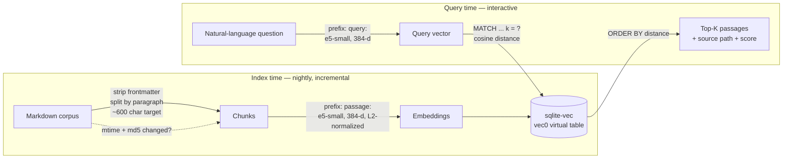

# Semantic Vault Search — a local, offline RAG retrieval engine

> **What this is.** A self-contained semantic search engine over a private
> Markdown corpus. It runs **fully offline** with **no vendor API**: a local
> sentence-embedding model turns notes and queries into vectors, a `sqlite-vec`
> vector store does cosine-similarity retrieval, and results come back ranked by
> meaning rather than keyword overlap. It is the **retrieval layer of a RAG
> system** — the "R" you wire under any LLM that needs grounded context.

This folder is a recruiter-legible extract of a component that runs in
production inside a larger personal-assistant codebase. The production code is
**not duplicated here** — the demo imports it directly (see
[Relationship to production](#relationship-to-production-code)).

The demo goes past "embeddings work" and shows the three things a RAG layer
actually needs to be trustworthy:

| Concern | What the demo shows | Section |
|---|---|---|
| **Grounding / citations** | every answer cites its source *file + chunk index + similarity score* — the audit trail an LLM and a human use to verify the answer | [Grounding](#grounding--every-answer-cites-its-source) |
| **Refuse-to-answer** | a similarity threshold: when the best match is too weak, return *"not in corpus / I won't answer"* instead of a confident wrong passage | [Refusal](#the-refuse-to-answer-path-anti-hallucination) |
| **Why embeddings** | a naive keyword baseline run *side-by-side* with the semantic engine on queries whose words don't appear in the source | [Naive vs semantic](#naive-keyword-vs-semantic--measured) |

---

## The problem

I keep a few thousand Markdown notes in a private knowledge base (an Obsidian
vault): infra runbooks, finance notes, project specs, journals. I want to ask it
questions in natural language and get the *right passage* back — even when I
don't remember the exact words I used when I wrote it.

Constraints that shaped the design:

| Constraint | Consequence |
|---|---|
| **Private corpus** | Notes can't be shipped to a third-party embedding API. |
| **Offline** | Must work on a laptop with no network (planes, travel). |
| **No recurring cost** | No per-query API spend. |
| **Recall by *concept*** | `"how I split my savings"` must find a note titled *"position weighting"* — zero shared keywords. |
| **Fast enough to feel instant** | Sub-100 ms per query after warmup. |

A first version (`vault-search` v1) used keyword expansion + `ripgrep`. It missed
roughly a third of queries because it still depended on literal token overlap.
**v2 replaces lexical matching with dense semantic retrieval.**

---

## The approach

```
                          INDEX TIME (batch, nightly cron)
  ┌────────────┐   chunk    ┌──────────┐  embed "passage:"  ┌──────────────┐
  │ .md corpus │ ─────────► │  chunks  │ ─────────────────► │  sqlite-vec  │
  │ (vault)    │ paragraph  │ ~600 chr │  e5-small (384-d)  │  vec0 table  │
  └────────────┘            └──────────┘   normalized       └──────────────┘
                                                                   ▲
                          QUERY TIME (interactive)                 │ cosine
  ┌────────────┐  embed "query:"   ┌──────────┐   MATCH + k = ?    │ top-K
  │ "question" │ ────────────────► │  vector  │ ───────────────────┘
  └────────────┘  e5-small (384-d) └──────────┘   ORDER BY distance
                                                        │
                                                        ▼
                                            ranked passages + source file
```

### Architecture (mermaid)



### Key design choices

**Embedding model — `intfloat/multilingual-e5-small`.**
384-dimensional, ~470 MB, strong FR/EN performance (the corpus is bilingual).
e5 is an *instruction-tuned asymmetric* model: documents must be embedded with a
`passage:` prefix and queries with a `query:` prefix. Honouring that asymmetry
is what makes a short question match a long note about the same idea. Small +
quantizable means it runs on a laptop CPU.

**Chunking — paragraph-based with a character cap.**
See [How chunking works](#how-chunking-works-the-production-chunker) below for the
full walkthrough of the production `chunk_markdown` the demo imports. In short:
strip YAML frontmatter, split on blank lines, aggregate paragraphs up to a
~600-char target, hard-cap at 1500 (over-long paragraphs fall back to sentence
splitting), drop sub-20-char fragments. A paragraph is the natural unit of a
single idea in Markdown, so each chunk embeds *one* coherent thought — which
keeps retrieval precise and the returned snippet readable.

**Vector store — `sqlite-vec`.**
A SQLite extension exposing a `vec0` virtual table with native cosine search.
Why SQLite and not a dedicated vector DB (FAISS, Qdrant, pgvector)? The corpus is
thousands of chunks, not millions; SQLite gives a **single-file, zero-server,
embeddable** store that ships in the same `~5 MB` DB as the chunk text and file
metadata. One `JOIN` returns the vector match *and* its source passage. For this
scale it is the right amount of machinery — no daemon to run, no container.

**Ranking.**
Vectors are L2-normalized at index *and* query time, so cosine distance is a
direct similarity measure. Retrieval is `WHERE embedding MATCH ? AND k = ?
ORDER BY distance` (sqlite-vec's KNN form). Displayed score is `(1 − distance)`
as a percent — higher is closer.

**Incremental indexing.**
The nightly job re-embeds a file only when both its `mtime` *and* its `md5` have
changed (so a `touch` doesn't trigger re-embedding), and prunes DB rows for files
deleted from disk.

### As a RAG building block

This is the **retrieval** stage of retrieval-augmented generation. To turn it
into full RAG you add one step: take the top-K passages this engine returns, pack
them into a prompt as grounding context, and let an LLM answer *from those
passages*. The hard, latency- and quality-critical part — getting the *right*
context in front of the model — is exactly what this component does. It is
deliberately decoupled from any specific LLM so the same index serves a CLI, a
chat bot, and batch jobs.

---

## Run it yourself

The demo runs the **real pipeline** on a tiny public sample corpus included in
[`sample_corpus/`](./sample_corpus) — five short notes on unrelated topics
(infra, investing, cooking, travel, fitness) — so you don't need the private
vault.

```bash
# from this folder
pip install "sentence-transformers>=2.7" sqlite-vec numpy   # ~once
python demo.py --bench
```

First run downloads the embedding model (~470 MB) into the HuggingFace cache.
**If the dependencies aren't installed, the demo degrades gracefully** — it
prints install instructions and exits cleanly instead of crashing.

```bash
python demo.py "your own question here"   # ad-hoc query (grounded + refusal gate)
python demo.py --compare                   # naive keyword vs semantic, side by side
python demo.py --refuse-demo               # the refuse-to-answer (anti-hallucination) path
python demo.py -k 5                         # top-5 instead of top-3
python demo.py --threshold 45              # override the refusal threshold (percent)
```

---

## Grounding — every answer cites its source

Retrieval is only useful if you can *trace* an answer back to where it came from.
Every result the demo prints is a **citation**: `file#chunkN @ score%`. That is
the three-part audit trail a RAG layer hands to the LLM ("answer *only* from
these passages") and to a human ("here's the exact paragraph I'm relying on").

The five demo queries are written so a **keyword search would miss** the correct
note (no shared words with the target), yet semantic retrieval finds it as the
top hit. Output captured verbatim from `python demo.py --bench`:

```
Indexed 5 files / 6 chunks from sample_corpus/
Model load: 10.22s   Index build: 0.33s

Q: "what's my strategy for splitting up my savings"   (29 ms)
   47.2%  investing.md#chunk0     # How I size positions My long-term capital is split between a tax-advantaged equity wrapper…
   39.5%  fitness.md#chunk0       The goal is to add lean mass without losing the cardio base…
   39.1%  homelab.md#chunk1       Snapshots run nightly to a separate disk pool…
  grounding: top hit = investing.md#chunk0 @ 47.2%   ✓

Q: "keeping my home network secure"   (33 ms)
   45.6%  homelab.md#chunk0       # Running services at home I keep a small rack of machines…
   37.6%  homelab.md#chunk1       Snapshots run nightly to a separate disk pool…
   37.4%  investing.md#chunk0     # How I size positions…
  grounding: top hit = homelab.md#chunk0 @ 45.6%   ✓

Q: "I get queasy on long bus rides"   (34 ms)
   40.4%  travel.md#chunk0        # How I like to travel I favour Southeast and East Asia…   (source text: "motion sickness")
   38.1%  fitness.md#chunk0       The goal is to add lean mass…
   37.3%  cooking.md#chunk0       A pot of rice and a fragrant tomato-and-onion base…
  grounding: top hit = travel.md#chunk0 @ 40.4%   ✓

Q: "vegetarian comfort meal for a cold evening"   (34 ms)
   49.2%  cooking.md#chunk0       A pot of rice…   (source text: "slow-braised lentils over rice")
   ...
  grounding: top hit = cooking.md#chunk0 @ 49.2%   ✓

Q: "how do I bulk up without losing endurance"   (31 ms)
   49.8%  fitness.md#chunk0       The goal is to add lean mass without losing the cardio base…
   ...
  grounding: top hit = fitness.md#chunk0 @ 49.8%   ✓
```

The `✓` is a self-check: each demo query declares its expected target file, and
the run asserts the top hit matches it. **All 5/5 pass.** Note the
cross-vocabulary hits — *"queasy on long bus rides"* → the travel note whose
actual text is *"motion sickness"*; *"vegetarian comfort meal"* → the cooking note
about *"slow-braised lentils"*. No keyword engine makes those jumps (proven
below).

---

## The refuse-to-answer path (anti-hallucination)

A retriever that *always* returns its top-K is a hallucination machine waiting to
happen: ask it something not in the corpus and it will still hand the LLM its
best — but weak — match, which the LLM then dresses up as a confident answer.

The fix is a **similarity threshold**. If the top hit scores below it, the engine
returns *"not found in corpus / I won't answer"* and feeds the LLM nothing. On
this corpus the threshold is **40 %**, chosen from measured data: the relevant
demo queries top out at 40.4–49.8 %, while off-topic probes land below ~35 %.
Captured from `python demo.py --refuse-demo`:

```
Refuse-to-answer gate — threshold = 40% similarity

Q: "what is the capital of France"
  ⛔ REFUSED — best match was investing.md @ 28.8% (< 40%). Returned: "not found in corpus / I won't answer".

Q: "how do I file my taxes in Germany"
  ⛔ REFUSED — best match was investing.md @ 34.9% (< 40%). Returned: "not found in corpus / I won't answer".

Q: "how to change a car tyre on the motorway"
  ⛔ REFUSED — best match was fitness.md @ 31.3% (< 40%). Returned: "not found in corpus / I won't answer".
```

All three off-topic questions are refused. The same gate applies to ad-hoc
queries (`python demo.py "what is the capital of France"` → refused) and the
threshold is tunable with `--threshold`.

> **Honest caveat — the threshold is a knob, not a law.** On this tiny corpus the
> relevant and off-topic bands are close (~40 % vs ~30–35 %), and a probe like
> *"what are the symptoms of diabetes"* measures ~40 %, right on the line. With a
> single global cosine threshold you trade off false-refusals against false-
> answers; the right value depends on the corpus and the cost of each error. The
> demo's point is the **mechanism** (a calibrated floor that produces an explicit
> refusal), not that 40 % is universal. A production system would calibrate per
> corpus and could add a cross-encoder re-rank above the floor.

---

## Naive keyword vs semantic — measured

To make the value of embeddings concrete, the demo ships a **naive keyword
baseline** — the v1-style approach embeddings replaced. It scores each chunk by
how many distinct query *words* literally appear in it (case-insensitive token
overlap, no stemming, no synonyms). Both engines run on the same three queries,
chosen so the question shares **no meaningful words** with the target note.
Captured from `python demo.py --compare`:

```
Q: "I get queasy on long bus rides"
   concept the words don't carry: queasy/bus -> 'motion sickness' / 'road transfers'
  NAIVE keyword:
    hits=3  fitness.md#chunk0       [matched: get,i,on]
    hits=3  travel.md#chunk0        [matched: i,long,on]
    hits=2  homelab.md#chunk0       [matched: i,on]
  SEMANTIC:
     40.4%  travel.md#chunk0        # How I like to travel I favour Southeast and East Asia…
     38.1%  fitness.md#chunk0       The goal is to add lean mass…
     37.3%  cooking.md#chunk0       A pot of rice…
  -> naive top: fitness.md (miss)  |  semantic top: travel.md (hit)

Q: "vegetarian comfort meal for a cold evening"
   concept the words don't carry: vegetarian/comfort -> 'slow-braised lentils over rice'
  NAIVE keyword:
    hits=2  fitness.md#chunk0       [matched: a,for]
    hits=2  investing.md#chunk0     [matched: a,for]
    hits=2  travel.md#chunk0        [matched: a,for]
  SEMANTIC:
     49.2%  cooking.md#chunk0       A pot of rice…
     37.1%  fitness.md#chunk0       The goal is to add lean mass…
     35.6%  travel.md#chunk0        # How I like to travel…
  -> naive top: fitness.md (miss)  |  semantic top: cooking.md (hit)

Q: "how do I bulk up without losing endurance"
   concept the words don't carry: bulk up/endurance -> 'add lean mass' / 'cardio base'
  NAIVE keyword:
    hits=4  fitness.md#chunk0       [matched: endurance,i,losing,without]
    ...
  SEMANTIC:
     49.8%  fitness.md#chunk0       The goal is to add lean mass…
  -> naive top: fitness.md (hit)  |  semantic top: fitness.md (hit)

Result: semantic found the right note on 2/3 queries where the naive keyword
baseline did not.
```

The first two queries are the punchline: the naive baseline's "matches" are pure
**stopwords** (`i`, `on`, `a`, `for`) — so it ranks the *wrong* note to the top
while the real target sits lower or absent. Semantic retrieval ignores the
surface words and matches on meaning ("queasy on bus rides" → "motion sickness").

The third query is reported honestly as a **non-win**: *"endurance"*,
*"losing"* and *"without"* happen to appear verbatim in the fitness note, so the
naive baseline gets it right too. That is the truthful shape of the trade-off —
keyword search works exactly when vocabulary overlaps, and fails the moment it
doesn't. **Net: semantic wins 2/3; the one tie is where keywords genuinely
overlapped.**

---

## How chunking works (the production chunker)

The demo does not reimplement chunking — it imports `chunk_markdown()` straight
from the production indexer ([`bin/jarvis-vault-index.py`](../../bin/jarvis-vault-index.py)).
The algorithm, in order:

1. **Strip YAML frontmatter.** If the file starts with `---`, everything up to
   the closing `---` is dropped (titles/tags are metadata, not retrievable prose).
2. **Split on blank lines** (`\n\s*\n`) into paragraphs — the natural unit of one
   idea in Markdown.
3. **Drop fragments < 20 chars.** Lone bullets, stray headings and separators are
   noise that would dilute a chunk's embedding.
4. **Aggregate toward a ~600-char target.** Consecutive paragraphs are glued
   together (with the blank line preserved) until adding the next would exceed
   `CHUNK_TARGET_CHARS = 600`; then the current chunk is flushed and a new one
   starts. This keeps chunks big enough to carry context but small enough to stay
   a single topic.
5. **Hard cap at 1500 chars.** A single paragraph longer than `CHUNK_MAX_CHARS`
   falls back to **sentence splitting** (`(?<=[.!?])\s+`), re-aggregated to the
   600-char target — so one giant wall of text can't become one giant vector.

**Why these choices.** A chunk is the atomic unit retrieval returns and the LLM
grounds on, so it must embed *one coherent thought*. Too large → the vector
averages several topics and similarity blurs; too small → context is lost and the
snippet is useless to a human. Paragraph-first with a soft target + hard cap is
the cheap, deterministic middle ground that needs no model at index time. In the
sample corpus this produces **6 chunks from 5 files** — `homelab.md` is the one
note long enough to split into two (`#chunk0` running services + segmentation,
`#chunk1` backups), which is why its backups paragraph is independently citable
above.

---

## Measured numbers (this machine — Apple Silicon laptop, CPU only)

> Honest disclosure: these are tiny-corpus numbers I actually measured with
> `python demo.py --bench` (averaged across repeated runs). Your hardware and
> corpus will differ. The absolute latencies matter less than the shape:
> **one-time model load, then queries in tens of milliseconds.**

| Stage | Measured |
|---|---|
| Model load (cold, from disk cache) | ~10.0–10.8 s |
| Index build (6 chunks → embeddings → sqlite-vec) | ~0.3 s |
| Query, average of 5 (warm model, in-process) | ~32–34 ms |

The cold model load is paid once per process; in production the CLI keeps it warm
within a session, and indexing is a nightly batch, so the interactive cost a user
feels is the per-query figure.

---

## Relationship to production code

This showcase **does not fork** the engine. `demo.py` imports the production
modules by path and calls their real functions:

- **Chunker** — `demo.py` imports `chunk_markdown()` straight from
  [`bin/jarvis-vault-index.py`](../../bin/jarvis-vault-index.py). The demo's index
  build is the same chunk → `passage:` prefix → embed → `vec0` flow as the
  production indexer.
- **Query path** — the demo's `search()` mirrors
  [`bin/vault-search-v2.py`](../../bin/vault-search-v2.py) exactly: the e5
  `query:` prefix, the `WHERE embedding MATCH ? AND k = ? ORDER BY distance`
  sqlite-vec query shape, and the `(1 − distance) × 100` score the production CLI
  prints.

The grounding/refusal/naive-baseline layers are **demo-only additions on top of**
that shared retrieval — they wrap the production query path, they don't alter it.
The refusal gate and the keyword baseline live entirely in `demo.py`; the
production CLI is the raw ranked retriever, exactly as imported.

The only thing the demo substitutes is the **corpus** (tiny public fixtures
instead of the private vault) and the **DB location** (in-memory instead of
`~/.local/share/jarvis/vault.db`) — so it's runnable by anyone, while exercising
the production logic rather than a reimplementation.

Production source:
[`bin/vault-search-v2.py`](../../bin/vault-search-v2.py) (search engine) and
[`bin/jarvis-vault-index.py`](../../bin/jarvis-vault-index.py) (indexer).

---

## Files in this showcase

| File | Purpose |
|---|---|
| `README.md` | This write-up. |
| `demo.py` | Runnable demo: imports the production chunker, builds an in-memory sqlite-vec index over the sample corpus, then runs **grounded** semantic queries (file#chunk + score citations), a **refuse-to-answer** threshold gate (`--refuse-demo`), and a **naive-keyword-vs-semantic** side-by-side (`--compare`), printing measured timings (`--bench`). Degrades gracefully without deps. |
| `sample_corpus/*.md` | Five short public notes so the demo runs without the private vault. |
